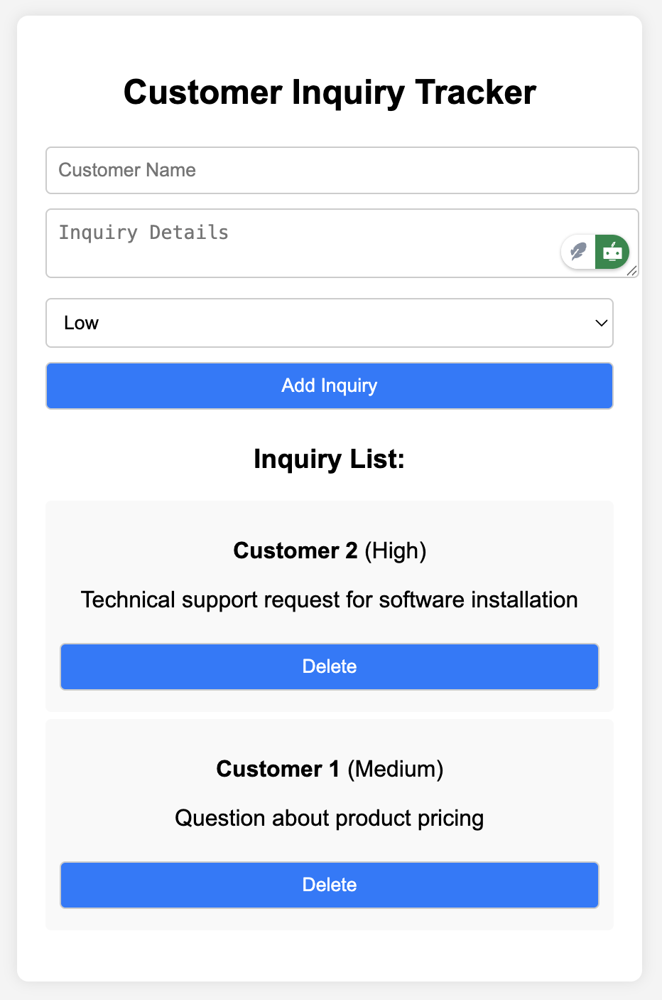

# Customer Inquiry Tracker

A Vue.js application for tracking customer inquiries. This application allows you to add, view, and manage customer inquiries with priority levels.

## Features
- Add new customer inquiries with name, details, and priority level
- View list of all inquiries
- Delete existing inquiries
- Priority levels: Low, Medium, High
- Responsive design with modern UI

## Screenshot


## Current State
The application currently stores data in memory. Data will be lost upon page refresh or browser closure.

## Project setup
```
npm install
```

### Compiles and hot-reloads for development
```
npm run serve
```

### Compiles and minifies for production
```
npm run build
```

### Lints and fixes files
```
npm run lint
```

## Future Improvements
- Implement persistent data storage
- Add search and filter functionality
- Add status tracking for inquiries
- Add timestamps for inquiries
- Add user authentication

### Customize configuration
See [Configuration Reference](https://cli.vuejs.org/config/).
